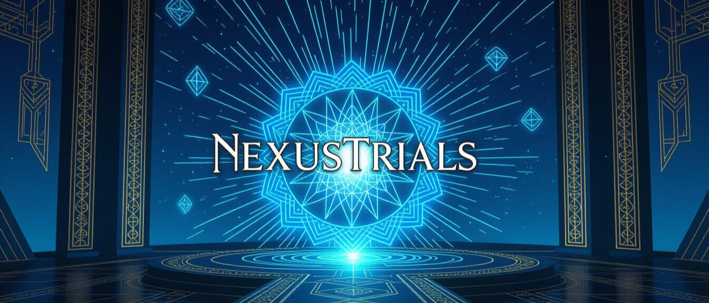

# NexusTrials

**A portfolio demonstration of enterprise-grade QA automation and AI validation frameworks applied to game development.**

> **⏱️ Short on time?** See [PORTFOLIO.md](PORTFOLIO.md) for a recruiter-friendly overview (2-minute read).

**Full details below** ↓

---

**Detailed description starts here:**

## Project Positioning

**For Game Studios**: A reference implementation showing how professional-grade test automation frameworks can be integrated into game development pipelines, enabling:
- Deterministic automated testing of game systems
- Distributed load testing across multiple game servers
- AI-powered behavior validation and anomaly detection
- Chaos engineering for network robustness

**For QA Professionals**: A concrete example of applying 10+ years of enterprise QA expertise to the gaming domain, demonstrating proficiency with:
- Test framework architecture (similar patterns to JUnit/Cypress/Mocha)
- Backend/API validation (medical imaging → game servers)
- Frontend automation (Cypress experience → Unreal UI testing)
- CI/CD integration and distributed testing

## Game Overview

NexusTrials includes three gameplay variants to exercise different framework capabilities:

### 1. **Third Person (Base)**
Classic third-person action gameplay with:
- Character movement and camera control
- Item collection and pickups
- Interactive world objects

### 2. **Combat Variant**
Action-oriented combat system featuring:
- Melee attack mechanics with combo system
- Enemy AI (Grumblin-inspired enemies)
- Environmental hazards (lava, platforms)
- Health system and damage feedback
- State-based architecture using StateTree

### 3. **Platforming Variant**
Precision platformer with:
- Advanced movement mechanics (dashing, wall-sliding)
- Challenging level design
- Checkpoint system
- Environmental puzzles

### 4. **Side-Scrolling Variant**
2D side-scroll action featuring:
- Side-view perspective with custom camera
- NPC interactions
- Interactive elements (jump pads, moving platforms)
- Pickup and inventory system

## Technology Stack

- **Engine**: Unreal Engine 5.7
- **Language**: C++
- **QA Frameworks**: 
  - [NexusQA](https://github.com/calionestevar/NexusQA) - Test automation framework (Git submodule)
  - OrionAI - AI validation and anomaly detection system
- **Testing Capabilities**: Automated QA, distributed tracing, chaos engineering, performance analysis
- **State Management**: StateTree, GameplayStateTree
- **Build System**: UnrealBuildTool with Visual Studio 2022 Community
- **CI/CD Ready**: Designed for automated pipelines and headless testing

## Background & Experience

**10-Year QA Automation Career:**
- **Cerner (5 years)**: Tested DICOM storage systems and medical image archives using proprietary JUnit framework, validating complex backend/API workflows in healthcare systems
- **AGI SureTrack (2 years)**: Automated testing of agricultural technology products using Cypress for frontend validation
- **Garmin (2+ years)**: Testing marine products across both frontend (Cypress) and backend (Mocha) stacks

**Why This Project**: Transitioning this proven enterprise QA expertise into game development by demonstrating how professional-grade test frameworks and AI validation can solve the same problems in the gaming space—reliability, compliance, performance, and user safety.


## Project Structure

```
NexusTrials/
├── Source/
│   ├── NexusTrials/              # Base game module
│   │   ├── Public/
│   │   └── Private/
│   └── NexusTrials.Target.cs     # Build target definitions
├── Content/
│   ├── ThirdPerson/              # Base variant assets
│   ├── Variant_Combat/           # Combat-specific content
│   ├── Variant_Platforming/      # Platforming-specific content
│   ├── Variant_SideScrolling/    # Side-scroll-specific content
│   └── [Additional assets]
├── Plugins/
│   └── NexusQA/                  # Testing framework (submodule)
├── Config/
│   ├── DefaultEngine.ini
│   ├── DefaultGame.ini
│   └── [Engine configuration]
└── NexusTrials.uproject          # Project configuration
```

## Getting Started

### Prerequisites

- **Unreal Engine 5.7** ([Download](https://www.unrealengine.com/))
- **Visual Studio 2022** Community Edition or higher
- **Windows 10/11** with latest SDK (10.0.22621.0)
- **Git** with LFS support (for submodules)

### Setup

1. **Clone the repository** with submodules:
   ```bash
   git clone --recurse-submodules https://github.com/yourusername/NexusTrials.git
   cd NexusTrials
   ```

2. **Generate Visual Studio project files**:
   ```bash
   .\NexusTrials\NexusTrials.uproject -GenerateProjectFiles
   ```

3. **Open the project** in Unreal Editor:
   ```bash
   # Via Epic Launcher: Select NexusTrials.uproject
   # Or use the engine directly:
   "C:\Program Files\Epic Games\UE_5.7\Engine\Binaries\Win64\UE4Editor.exe" "NexusTrials\NexusTrials.uproject"
   ```

4. **Build the project**:
   ```bash
   .\NexusTrials\NexusTrials.uproject -Build
   ```

## Key Features

### Game Systems

- **Health & Damage System**: Configurable HP, damage types, invincibility frames
- **Power-Up System**: Collectible power-ups with distinct effects
- **Fall Damage Calculator**: Testable utility for fall damage physics
- **Enemy AI**: State-based behavior with collision detection
- **Checkpoint System**: Level progression and save points
- **Interactive Objects**: Environmental interactables and hazards

### Testing Framework Integration

NexusTrials integrates the **NexusQA** framework for:

- **Automated Testing**: Blueprint-callable test automation matching patterns from JUnit/Cypress/Mocha
- **Distributed Tracing**: Comprehensive gameplay event logging and centralized observability
- **Chaos Engineering**: Network fault injection, latency simulation, and packet loss scenarios (similar to AGI/Garmin network testing)
- **Performance Analysis**: Frame time profiling, memory tracking, and bottleneck identification
- **Compliance Testing**: Regulatory requirement validation (medical/automotive industry patterns)
- **AI Validation**: OrionAI integration for behavior verification and anomaly detection

**Example Usage**:
```cpp
// Activate distributed observer network for real-time test monitoring
UFringeNetwork::ActivateObserverNetwork();

// Run distributed tests across multiple game server instances
UFringeNetwork::RunObserverNetworkTests(PrimaryServerURL);

// Inject network chaos to validate robustness (latency, packet loss, etc.)
UFringeNetwork::InjectCortexiphanChaos(DurationSeconds);

// AI-powered behavior validation via OrionAI
UOrionAI::ValidateGameplayBehavior(TestScenario, ExpectedBehaviors);
```

This demonstrates enterprise QA patterns applied to game systems—the same rigor used for medical imaging validation, agricultural automation, and marine navigation now applied to gameplay mechanics and game server reliability.

## Configuration

### Engine Settings
Edit `Config/DefaultEngine.ini` for:
- Graphics quality
- Physics parameters
- Input mappings
- Audio settings

### Game Settings
Edit `Config/DefaultGame.ini` for:
- Game mode selection
- Player controller configuration
- Gameplay parameters

### Input Configuration
Edit `Config/DefaultInput.ini` to customize:
- Keyboard/gamepad bindings
- Mouse sensitivity
- Action mappings per variant

## Development

### Building from Source

**Clean rebuild**:
```bash
cd NexusTrials
& "C:\Program Files\Epic Games\UE_5.7\Engine\Build\BatchFiles\Build.bat" NexusTrialsEditor Win64 Development -Project="path/to/NexusTrials.uproject" -Progress
```

**Incremental build** (inside Unreal Editor):
- Use the Compile button or `Ctrl+Shift+B`

### Code Organization

- **Character Systems**: `Source/NexusTrials/NexusTrialsCharacter.h|cpp`
- **Game Modes**: `Source/NexusTrials/[Variant]GameMode.h|cpp`
- **Enemy AI**: `Source/NexusTrials/Variant_Combat/AI/`
- **Utilities**: `Source/NexusTrials/Utilities/`
- **Test Framework Integration**: Through NexusQA plugin

### Adding New Features

1. Create header in `Public/` with declarations
2. Implement in `Private/` with definitions
3. If testable, integrate with NexusQA test automation
4. Update documentation

## Testing

### Manual Testing

Launch any variant from the editor:
1. Open the desired level (`Lvl_ThirdPerson.umap`, `Lvl_Combat.umap`, etc.)
2. Click **Play** or press **Alt+P**
3. Use configured controls to test gameplay

### Automated Testing

Run automated tests through NexusQA:
```bash
# In the Unreal Editor console:
Nexus.RunTests
```

#### Test Patterns

NexusTrials demonstrates three test patterns with enterprise architecture:

**1. NEXUS_TEST** - Parallel-safe unit tests (thread pool execution)
**2. NEXUS_TEST_GAMETHREAD** - Game-thread tests with FNexusTestContext
**3. NEXUS_PERF_TEST** - Performance tests with ArgusLens metrics

Example with FNexusTestContext pattern:
```cpp
NEXUS_TEST_GAMETHREAD(FHealthTest, "NexusTrials.Character.Health", ETestPriority::Critical)
{
    if (!Context.IsValid()) return false;
    
    ANexusTrialsCharacter* Char = Context.SpawnTestCharacter(
        ANexusTrialsCharacter::StaticClass(), 
        FVector(0, 0, 100)
    );
    
    return Char->GetCurrentHealth() > 0.0f;
    // Actors automatically destroyed when Context scope ends (RAII)
}
```

Check `Plugins/NexusQA/` for detailed framework documentation.

## Performance

### Optimization Tips

- Use Scalability Settings in `DefaultEngine.ini`
- Enable Nanite for complex static meshes
- Use Lumen for real-time lighting
- Profile with `stat unit` console command
- Monitor network traffic with NexusQA's ParallelRealm testing

### Known Limitations

- Side-scrolling variant uses 2D camera projection
- Combat AI uses basic state machines (extendable via StateTree)
- Platforming variant has fixed checkpoints per level

## Troubleshooting

### Build Issues

**"Missing include file"**: Ensure all .h and .cpp files are in correct directories
```bash
# Regenerate project files
"C:\Program Files\Epic Games\UE_5.7\Engine\Build\BatchFiles\GenerateProjectFiles.bat"
```

**Linker errors**: Clean intermediate files:
```bash
Remove-Item -Recurse -Force "NexusTrials\Intermediate", "NexusTrials\Binaries"
```

### Runtime Issues

**Submodule not found**: Update submodules:
```bash
git submodule update --init --recursive
```

**Plugin not loading**: Check `NexusTrials.uproject` plugin list is accurate

## Contributing

This is a portfolio project. If you're a game studio or QA team interested in:
- Integrating professional test frameworks into your game pipeline
- Learning how enterprise QA practices apply to game development
- Building or improving your own testing infrastructure

Feel free to:
1. Fork the repository for reference
2. Examine the NexusQA framework integration patterns
3. Adapt the testing architecture for your own projects
4. Reach out with questions about test framework design

For pull requests: This is primarily a portfolio showcase, but improvements to the testing framework or documentation are welcome.


## License

This project is licensed under the MIT License - see the [LICENSE](LICENSE) file for details.

## Related Projects

- **[NexusQA](https://github.com/calionestevar/NexusQA)** - Testing framework used by this project
- **[Unreal Engine](https://github.com/EpicGames/UnrealEngine)** - Core engine repository

## Contact & Support

- **Portfolio**: [Your Portfolio URL]
- **LinkedIn**: [Your LinkedIn]
- **GitHub**: [Your GitHub Profile]
- **Email**: [Your Email]

**For Game Studios & QA Teams**: Interested in discussing test framework architecture, QA automation patterns, or team augmentation? Let's connect!

---

**Project Highlights for Hiring Managers:**

✅ **10 years of enterprise QA automation** applied to new domain (games)  
✅ **Medical imaging systems** (DICOM validation) → **Game server testing**  
✅ **Agricultural automation** (Cypress) → **Game client automation**  
✅ **Marine navigation** (network resilience) → **Game network chaos engineering**  
✅ **Framework design** at multiple companies → **NexusQA architecture**  
✅ **AI integration** → **OrionAI validation system**  
✅ **CI/CD ready** with distributed testing capabilities


## Changelog

### v1.1.0 (2026-01-02)
- **Refactored all GAMETHREAD tests to use FNexusTestContext pattern**
  - Context.SpawnTestCharacter() for managed actor creation
  - Automatic cleanup via RAII destructors
  - Context.PerformanceMetrics for performance assertions
- Updated NexusQA framework with ArgusLens performance metrics integration
- Added NEXUS_PERF_TEST macro for performance validation tests
- Enhanced ObserverNetworkDashboard integration for test reporting

### v1.0.0 (2025-12-28)
- Initial project recovery and reconstruction
- Three game variants (Combat, Platforming, SideScrolling) implemented
- NexusQA framework integration completed
- Full C++ codebase with automated testing support
- Project builds successfully on UE 5.7

---

**Happy developing!** 🎮

For more information, visit the [NexusQA documentation](https://github.com/calionestevar/NexusQA).
